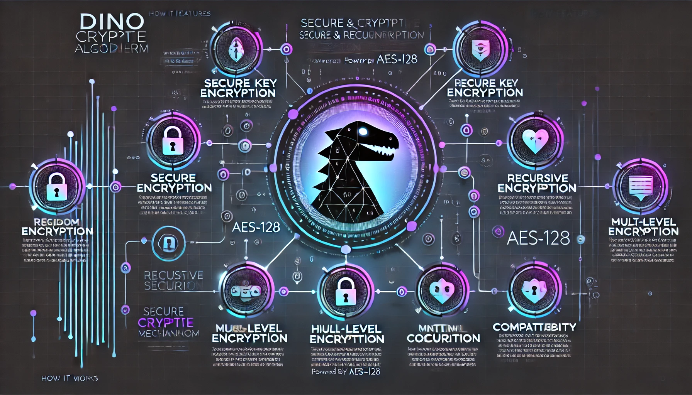

Below is a sample, highly detailed and engaging README.md file that you can use for your project. It leverages details from your documentation and source code to explain what the project does, how to install it, and how to use it—all in a way that’s sure to grab attention:

---

```md
# Dino_Crypto_Algorithm



Welcome to **Dino_Crypto_Algorithm** – a groundbreaking cryptographic solution that takes data security to the next level. By combining a proprietary recursive encryption mechanism with the robust AES-128 standard, this project ensures that your sensitive information remains completely protected—even if an encrypted key is intercepted.

---

## 🚀 Overview

**Dino_Crypto_Algorithm** is a state-of-the-art cryptographic engine built in C# designed for:
- **Multi-layered Security:** Recursive encryption of keys prevents unauthorized decryption even if parts of the encryption system are compromised.
- **AES-128 Integration:** Reinforces key protection by applying the well-known AES-128 standard as an additional security layer.
- **Complete Data Protection:** Both your data and encryption keys are encrypted with advanced techniques, ensuring unmatched confidentiality.
- **Cross-platform Compatibility:** Ideal for both desktop and web applications, offering seamless integration with a wide range of systems.

---

## 🌟 Key Features

- **Secure Key Encryption:**  
  The encryption key is initially obfuscated using an internal mechanism and then secured with AES-128, ensuring that it remains indecipherable to unauthorized users.

- **Recursive Encryption Mechanism:**  
  Data undergoes multiple layers of encryption, making brute-force and analytical attacks virtually impossible.

- **Robust AES-128 Encryption:**  
  Enhances security by applying a widely trusted encryption standard that balances speed and protection.

- **User-Friendly CLI:**  
  Easily encrypt and decrypt text, files, or entire directories through a versatile command-line interface.

- **High Compatibility:**  
  Designed in C#, this algorithm can be integrated into various applications with minimal effort.

---

## 🔧 Installation

### Prerequisites
- [.NET 5.0 (or later)](https://dotnet.microsoft.com/download)
- A C# development environment (e.g., Visual Studio or Visual Studio Code)

### Clone the Repository
Clone the project from GitHub using the following command:

```bash
git clone https://github.com/Natiqmammad/Dino_Crypto_Algorithm.git
cd Dino_Crypto_Algorithm
```

### Build the Project
Open the project in your preferred IDE or run:

```bash
dotnet build
```

---

## ⚙️ How to Run

**Dino_Crypto_Algorithm** provides a powerful command-line interface (CLI) for various encryption and decryption operations. Here’s how to get started:

### Encrypt Text
```bash
./DinoCrypto.exe --txt "Hello, World!"
```
- **`--txt`**: Encrypts the provided text string.
- The program outputs the encrypted text along with the encryption key.

### Decrypt Text
```bash
./DinoCrypto.exe -d --txt "YourEncryptedTextHere"
```
- **`-d`**: Switches the program to decryption mode.
- **`--txt`**: Decrypts the provided text.

### Encrypt a Directory
```bash
./DinoCrypto.exe --D "/path/to/your/directory"
```
- **`--D`**: Encrypts all files and subdirectories within the specified directory, including file names.

### Decrypt a Directory
```bash
./DinoCrypto.exe -d --D "/path/to/your/directory"
```
- Decrypts the contents and the names of files within the directory.

### Specify a Custom Encryption Key
```bash
./DinoCrypto.exe -K "YourEncryptedKey" --txt "SampleText"
```
- **`-K`**: Uses a user-specified encryption key (secured via AES-128) for the operation.

### Additional Commands
- **`--Win32`**: Applies Windows-compatible encryption for file and directory names.
- **`--aes`**: Adds an extra layer of AES encryption.
- **`-P`**: Enables Private Mode to suppress verbose logging.
- **`-R`**: Restricts the operation to renaming files/folders without modifying content.

For a complete list of commands, simply run:

```bash
./DinoCrypto.exe --help
```

---

## 🏗 Project Architecture

**Dino_Crypto_Algorithm** is modularly designed for clarity, maintainability, and scalability:

- **Core Modules:**
  - **DinoCipher.cs:** Contains the core recursive encryption and decryption logic.
  - **AesCipher.cs:** Implements AES-128 encryption/decryption methods to secure keys and data.
  - **KeyManager.cs:** Manages key generation, storage, and retrieval processes.

- **File Handling Modules:**
  - **FileEncryptor.cs:** Responsible for encrypting/decrypting the contents of files.
  - **DirectoryEncryptor.cs:** Manages encryption/decryption of file and folder names recursively.

- **CLI Modules:**
  - **CommandParser.cs:** Parses command-line arguments and directs operations.
  - **UserInterface.cs:** Provides an interactive user experience for encryption/decryption tasks.

This design ensures each component has a single responsibility, making the system robust and easily extendable.

---

## 📚 Detailed Documentation

For an in-depth explanation of the encryption algorithm, including the secure key encryption process and recursive mechanisms, refer to the comprehensive [Cryptography Algorithm Documentation](Documentation/Cryptography_Algorithm_Documentation.docx) provided within the repository.

---

## 🤝 Contributing

We welcome contributions to enhance **Dino_Crypto_Algorithm**! If you have ideas, bug fixes, or new features:
1. Fork the repository.
2. Create a new branch (e.g., `git checkout -b feature/YourFeature`).
3. Commit your changes.
4. Push your branch (`git push origin feature/YourFeature`).
5. Open a pull request.

For any issues or feature requests, please use the GitHub Issues section.

---

## 📝 License

This project is licensed under the MIT License. Please see the [LICENSE](LICENSE) file for further details.

---

## 📞 Contact

For questions, feedback, or support, please open an issue in the repository or contact us directly.

---

Embrace next-level cryptography with **Dino_Crypto_Algorithm** and protect your data with confidence. Secure your digital world—one encryption layer at a time!
